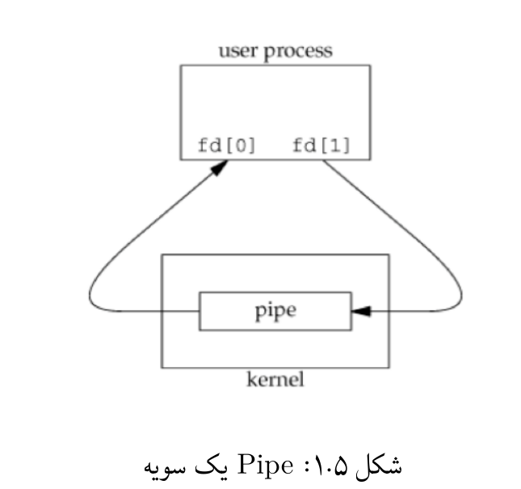
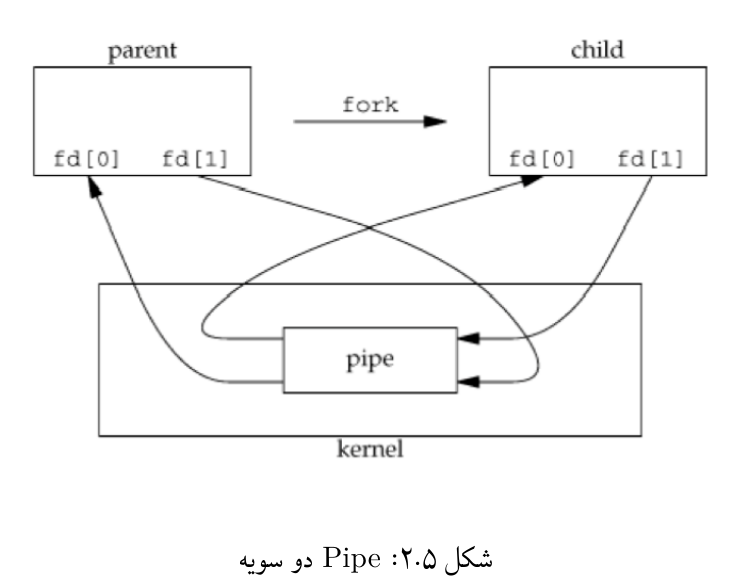

<div dir="rtl" align='justify'>

# آزمایش ۵ - ارتباط بین پردازه‌ای

## ۵.۱ مقدمه

در این جلسه آزمایشگاه مکانیزم‌های مربوط به ارتباط و تبادل
پیام بین پردازه‌ها در سیستم عامل لینوکس را خواهیم آموخت.

### ۵.۱.۱ پیش‌نیازها

انتظار می‌رود که دانشجویان با موارد زیر از پیش آشنا باشند:

1. نحوه‌ی ایجاد پردازه‌ها در سیستم عامل لینوکس (مطالب جلسه
چهارم)
1. برنامه‌نویسی به زبان C++/C
1. دستورات پوسته‌ی لینوکس که در جلسات قبل فرا گرفته شده‌اند.

## ۵.۲ ارتباط بین پردازه‌ها

در جلسات قبل نحوه‌ی ایجاد پردازه‌های جدید را آموختیم. در
این جلسه سعی داریم روش‌های ارتباط میان این پردازه‌ها را
بررسی کنیم. مکانیزم‌های متعدیی برای تبادل پیام بین
پردازه‌ها وجود دارد که در این جلسه دو روش
استفاده از Pipe و Signal را بررسی خواهیم کرد.
از جمله کاربردهای ارتباط بین پردازه‌ای می‌توان به همگام سازی
و انتقال اطلاعات اشاره کرد.

Pipe
ها، برای کاربران پوسته‌ی لینوکس آشنا هستند. برای مثال شما
می‌توانید برای مشاهده لیست پردازه‌هایی که در آن‌ها کلمه‌ی init
وجود دارد از دستور `ps aux | grep init` استفاده کنید. در
اینجا دو پردازه به کمک یک Pipe‌به هم متصل شده‌اند. نکته‌ای
که در اینجا مهم است آن است که این Pipe ایجاد شده تنها در
یک جهت (از پردازه اول به پردازه دوم) اطلاعات را جابه‌جا
می‌کند. به کمک فراخوانی‌های سیستمی می‌توان Pipe های دو سویه
و حلقوی نیز ایجاد کرد.

## ۵.۳ شرح آزمایش

### ۵.۳.۱ ایجاد یک Pipe یک‌سویه

* (آ) برای ایجاد Pipe‌یک سویه در سیستم عامل لینوکس از
فراخوانی سیستمی `pipe` استفاده می‌شود. به کمک
دستور `man 2 pipe` خلاصه‌ای از نحوه‌ی کار آن را ملاحظه کنید.
* (ب) به کمک کد زیر یک Pipe‌ایجاد کنید.

<div dir="ltr" >
        
```c
int fd[2];
int res = pipe(fd);
```
        
</div>
        
دستور `pipe` در اینجا دو File Descriptor ایجاد می کند
(آرایه fd). یکی از آن‌ها برای خواندن و دیگری برای نوشتن
مورد استفاده قرار خواهد گرفت. `fd[0]` برای خواندن
و `fd[1]` برای نوشتن خواهد بود.
* (ج) تا اینجا تنها یک پردازه داریم و می‌توان شمای
کلی fdهای ایجاد شده را در شکل ۵.۱ نشان داد:



هر چیزی که بر روی `fd[1]` نوشته شود، قابل خواند با `fd[0]`
خواهد بود. حال توجه کنید که در صورتی که عملیات fork انجام
گیرد، پردازه‌ی فرزند، File Descriptor های پدر را به ارث
خواهد برد. بنا بر این، بعد از انجام شدن عملیات `fork`
و ایجاد پردازه فرزند، ساختار بالابه شکل ۵.۲ در خواهد آمد.



مشکل مهمی که در اینجا با آن مواجه هستیم آن است که در صورتی
که هر دو پردازه بخواهند بر روی Pipe بنوسید و یا از آن
بخوانند، به دلیل اینکه تنها یک بافر مشترک داریم، رفتار
قابل پیش بینی نخواهد بود. در این حالت یک پردازه ممکن است
داده‌ای که خودش بر روی Pipe قرار داده است را بخواند!
بنابر این نیاز است که یک طرف تنها بر روی Pipe‌بنویسد و یک
طرف تنها از آن بخواند. برای مثال فرض کنید پردازه‌ی فرزند
قصد خواند از Pipe‌و پردازه‌ی والد قصد نوشتن بر روی آن را
دارد. به کمک فراخوانی سیستمی `close` ، پردازه والد `fd[0]`
خود را می‌بندد (زیرا قصد خواندن ندارد) و پردازه‌ی فرزند
نیز `fd[1]` را خواهد بست. به این ترتیب یک
ارتباط Half-Duplex بین این دو پردازه ایجاد می‌شود.

**فعالیت‌ها**

* به کمک توضیحات بالا و استفاده از فراخوانی ‌های
سیستمی `write` و `read`، جمله‌ی `Hello World!` را از سمت
پردازه‌ی پدر به پردازه فرزند منتقل کرده و در پردازه‌ی فرزند
آن را چاپ کنید.

* همان‌طور که در جلسات پیش آموختیم، به کمک دستورات
خانواده  `exec` ، بعد از انجام `fork` می‌توان یک برنامه،
مثلا `ls` را اجرا نمود. به کمک دستورات `dup/dup2` برنامه‌ای
بنویسید که پردازه‌ی والد دستور `ls` و پردازه فرزند
دستور `wc` را اجرا کند و خروجی پردازه والد (دستور `ls`)
به عنوان وردوی به پردازه‌ي فرزند داده شود. 
  * (راهنمایی: یک Pipe‌ایجاد کنید به نحوی که خروجی پردازه والد
ورودی Pipe‌ باشد و خروجی Pipe به عنوان ورودی پردازه فرزند
باشد. اینکار با استفاده از دستورات `dup/dup2‍` ممکن است.)
  * (راهنمایی ۲: خروجی برنامه `ls` در `stdout` قرار می‌گیرد که
یک File Descriptor با شماره ۲ است. ورودی برنامه `wc`
از `stdin` است که یک File Descriptor‌ با شماره ۱ است.)

* بررسی کنید که چطور ارتباطات تمام دو طرفه بین پردازه‌ها
داشته باشیم.

### ۵.۳.۲ سیگنال‌ها

بعضی اوقات نیاز است که برنامه‌ها بتوانند با برخی از شرایط
غیر قابل پیش بینی مواجه شده آن‌ها را کنترل کنند.
برای مثال:

* درخواست بستن برنامه توسط کاربر به وسیله Ctrl + C
* رخ دادن یک خطا در محاسبات Floating Point
* مرگ پردازه فرزند

این رخدادها توسط سیستم عامل لینوکس شناخته می‌شوند و 
سیستم عامل با ارسال یک **سیگنال**، پردازه را از وقوع
آن‌ها آگاه می‌سازد. برنامه نویس می‌تواند این سیگنال‌ها را
نادیده بگیرد، یا در عوض با نوشتن کد آن‌ها را مدیریت و
کنترل نماید.

* به کمک دستور `man 7 signal` لیستی از سیگنال‌های موجود
در سیستم عامل لینوکس را ملاحظه کنید. سیگنال‌های زیر را
توضیح دهید.

SIGINT, SIGHUP, SIGSTP, SIGCONT, SIGKILL

* یک سیگنال ساده، سیگنال Alarm (SIGALRM) است. به کمک 
دستور `man` در مورد آن توضیح کوتاهی ارائه دهید.

* کد زیر به کمک این سیگنال نوشته شده است. آن را اجرا کرده
و در مورد کارکرد آن توضیح دهید.

<div dir="ltr" >
        
```c
#include <stdio.h>
#include <unistd.h>
int main() {
        alarm (5);
        printf ("Looping forever . . . \n");
        while (1);
        printf("This line should never be executed\n");
        return 0;
}
```
        
</div>

* به طور پیش فرض پردازه بعد از دریافت یکی از سیگنال‌های
تعریف شده، کشته می‌شود. به کمک فراخوانی سیستمی `signal`
می‌توان این رفتار را تغییر دارد و کد مورد نظر برنامه نویس
را اجرا کرد. همچنین یک فراخوانی سیستمی دیگر به نام `pause`
وجود دارد که پردازه را تا زمانی که یک سیگنال دریافت کند،
متوقف می‌سازد. به کمک این دو تابع، برنامه‌ی بالا را
به گونه‌ای ویرایش کنید که بعد از دریافت سیگنال SIGALRM از
توقف خارج شود و خط آخر را در خروجی چاپ کند.

* برنامه‌ای بنویسید که در صورتی که کاربر کلید‌های Ctrl + C
را فشار دهد، برای بار اول خارج نشود
و پیامی برای فشاردن دوباره آن‌ها چاپ کند.در دفعه دوم رخ
دادن سیگنال برنامه به پایان برسد.

</div>
