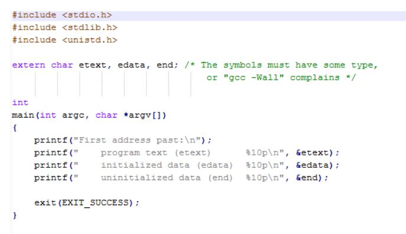

<div dir="rtl" align='justify'>

# آزمایش ۶ - مدیریت حافظه

## ۶.۱ مقدمه

در این جلسه از آزمایشگاه با ساختار حافظه ی پردازه ها آشنا خواهیم شد.

## ۶.۲ پیش‌نیازها

انتظار می‌رود که دانشجویان با موارد زیر از پیش آشنا باشند:

1. برنامه‌نویسی به زبان C++/C
1. دستورات پوسته‌ی لینوکس که در جلسات قبل فرا گرفته شده‌اند.

## ۶.۳ مدیریت حافظه

همان طور که می دانید، در زبان های برنامه نویسی سطح بالا، مانندC ،هنگامی که یک متغیر تعریف می کنید، کامپایلر فضای مورد نیاز برای آن ها را
در نظر می گیرد و نیازی به تخصیص فضا به صورت دستی ندارید. متغیر های سراسری در Segment Data پردازه و متغیر های محلی در Segment
Stack قرار می گیرند.
همچنین در برخی از شرایط نیاز است که حافظه به صورت پویا اختصاص یابد؛ برای مثال برای ایجاد یک داده ساختار مانند درخت یا لیست
پیوندی. در زبان برنامه نویسی C فراخوانی های سیستمی malloc و free برای این منظور وجود دارند.

## ۶.۴ شرح آزمایش


(آ) استفاده از فراخوانی های سیستمی malloc و free
*  ساختار زیر را فرض کنید  

<div dir="ltr" >
        
```c
struct MyStruct {
    int a;
    int b;
    char name[20];
}
```
        
</div>


* به کمک malloc حافظه ی مورد نیاز برای یک instance از این ساختار را تخصیص دهید. خروجی دستور malloc چیست؟
*  برای فیلد های instance ایجاد شده مقادیری را اختصاص دهید و آن ها را چاپ کنید.
* به کمک free حافظه ی گرفته شده را آزاد کنید.

(ب)  مشاهده وضعیت حافظه ی پردازه ها

* به کمک دستور زیر وضعیت حافظه ی پردازه ها را مشاهده کنید:

<div dir="ltr" >
        
```bash
ps -o user,vsz,rss,pmem,fname -e
```
        
</div>

*  به کمک دستور `ps map` توضیح دهید که هر کدام از ستون ها چه اطلاعاتی را نشان می دهند.

ج) اجزای حافظه ی یک پردازه

حافظه ی یک پردازه در سیستم عامل لینوکس به اجزای زیر تقسیم بندی می شود:

* بخش text که کد زبان ماشین پردازه را نگه داری می کند؛
  
* بخش data که متغیر های سراسری پردازه در آن قرار می گیرد، برخی از متغیر های دارای مقدار اولیه هستند و برخی خیر. دسته ی
دوم در بخشی به نام bss واقع می شوند؛

* بخش heap که شامل حافظه هایی است که به صورت پویا اختصاص داده می شود

*  بخش stack که متغیر های محلی، پارامتر های توابع و مقادیر بازگشتی آن ها در آن قرار دارد.

تصویر زیر این ساختار را نمایش می دهد (آدرس های کوچک تر در پایین تصویر قرار دارند):

<div align='center'>


</div>

 * به کمک دستور which محل قرار گیری دستور ls را بر روی دیسک پیدا کنید.
  
 * با استفاده از دستور size مشاهده کنید که چه مقدار از کد ماشین این دستور به بخش هایی که در بالا اشاره شد اختصاص دارد. این
دستور کدام یک از بخش های بالا را نشان نمی دهد؟

د) اشتراک حافظه

در سیستم عامل لینوکس، معماری حافظه به صورت صفحه بندی شده است؛ به این معنا که حافظه در تکه هایی (معمولا ٨١٩٢ یا ۴٠٩۶
بایتی) به پردازه ها اختصاص می یابد. سیستم عامل می تواند بعضی از این تکه ها را بین پردازه های مختلف به اشتراک بگذارد. برای مثال
تمام پردازه هایی که یک کد یکسان را اجرا می کنند، بخش text مشترک دارند. کاربرد دیگر اشتراک این صفحات برای کتابخانه های مشترک
است. برای مثال، اکثر برنامه ها از تابع printf استفاده می کنند؛ بنابراین منطقی است که تنها یکبار آن را در حافظه آورده و بین تمام
پردازه هایی که از آن استفاده می کنند، حافظه را به اشتراک بگذاریم.


* به کمک دستور ldd کتابخانه های مشترکی که توسط دستور ls استفاده شده است را مشاهده کنید.

* این کار را برای چند برنامه ی دیگر (برای مثال nano ) امتحان کنید و نتیجه را در گزارش کار خود بیاورید.

ه) آدرس های بخش های مختلف حافظه ی پردازه

به کمک استفاده از متغیر های extern خاصی که در سیستم عامل تعریف شده اند، قادر هستیم که آدرس پایان segment code ، آدرس
پایان segment global و همچنین آدرس پایان بخش متغیر های سراسری دارای مقدار اولیه را مشاهده کنیم.

برای این کار، سه متغیر زیر در دسترس هستند:

* etext :اولین آدرس بعد از پایان text در این متغیر قرار دارد.

* edata :اولین آدرس بعد از پایان متغیر های سراسری دارای مقدار اولیه در این متغیر قرار دارد.

* end :اولین آدرس بعد از پایان بخش bss در این متغیر قرار می گیرد.


در ادامه موارد زیر را انجام دهید:

* به کمک دستور `man etext` ، جزئیات بیشتری در مورد نحوه ی استفاده از این متغیر ها ببینید و کدی که به عنوان مثال در ادامه
این راهنما آمده است را نوشته و اجرا کنید.

* آیا خروجی این برنامه با ساختاری که در تصویر قبل آمده است تطابق دارد؟

<div align='center'>



</div>

* برای مشاهده ی آدرس انتهای heap از فراخوانی سیستمی sbrk استفاده می شود. به کمک این فراخوانی سیستمی نشان دهید که
با اجرا کردن malloc و اختصاص حافظه به صورت پویا، این آدرس انتهای heap هربار تغییر می کند.
* همان طور که گفته شد stack در جهت عکس heap رشد می کند. همچنین، متغیر های محلی و آرگومان های توابع در stack قرار
می گیرند. یک تابع بازگشتی بنویسید که ابتدا یک متغیر محلی i ایجاد کند؛ سپس آدرس i را چاپ کرده و دوباره خودش را فراخوانی
کند. روند تغییر آدرس متغیر i چگونه است؟ (برنامه را به گونه ای محدود کنید تا عملیات بازگشت مثلا ١٠٠ بار انجام شود).


</div>
